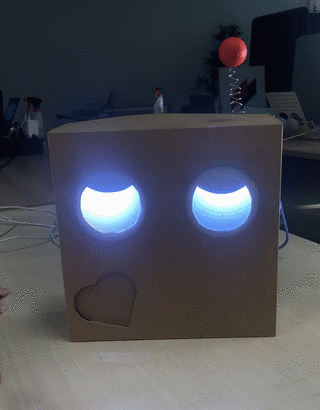

# projet_motifs_d_expression_2020

This repo holds the projects made by graphic design students @lecolededesign using [p5js](https://p5js.org/).

The course followed by students is an introduction to programming in javascript aimed at exploring interactive and generative patterns. It is available in french [here](https://github.com/b2renger/p5js-designing-interactive-patterns)

Code can be viewed and downloaded on this [github](https://github.com/AtelierNum/projet_generative-patterns_2019) repo.

Cet espace regroupe les projets réalisé par des étudiants en design graphique à l'école de design de Nantes suite à un cours d'introduction à [p5js](https://p5js.org/)

Le cours d'introduction à la programmation en javascript orienté vers la création de motifs interactifs et génératifs est disponible [ici](https://github.com/b2renger/p5js-designing-interactive-patterns)

Le code de ces projets peut-être consulté et téléchargé à partir de ce dépot [github](https://github.com/AtelierNum/projet_generative-patterns_2019)

Cet espace regroupe quelques projets réalisés par des étudiants en motion design à l'école de design Nantes Atlantique, suite à un cours d'introduction à [arduino](https://www.arduino.cc/)

Il a pour but de découvrir cette technologie et de travailler le mouvement physique à travers la construction d'une maquette en se posant les questions de : 
- Comment animer un visage en s'inspirant des principes de la mécatronique et de l'animatronique ? en privilégiant une approche graphique et sensible plutôt que technique et réaliste.
- Comment construire une narration autour d'une interaction simple ?

Inspiré par le projet [Eyes](https://www.lucaszanotto.com/portfolio/eyes) de Lucas Zanotto

Le code de ces projets peut-être consulté et téléchargé à partir de ce dépot [github](https://github.com/AtelierNum/projet_motifs_d_expression_2020)

## Marthe Aubineau et Alexia Simon

[cahier de recherches](https://www.lescahiersdudesign.fr/arduino-marthe-alexia)

## Alix Le Bail et Marine Brosseau

[cahier de recherches](https://www.lescahiersdudesign.fr/arduino-marine-alix)

## Candice Lambert et Anaïs Perbet

[cahier de recherches](https://www.lescahiersdudesign.fr/arduino-lambert-perbet)

## Anaelle Nemsguern et Pierre Jolivet

[cahier de recherches](https://github.com/AtelierNum/projet_motifs_d_expression_2020/Anaelle_et_Pierre/cahier_de_recherches.pdf)

## Romane Jubert et Neïla Melizi

[cahier de recherches](https://github.com/AtelierNum/projet_motifs_d_expression_2020/Romane_et_Neila/cahier_de_recherches.pdf)

